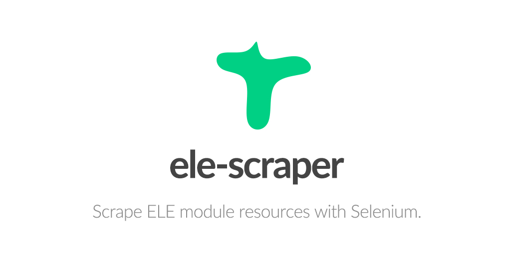
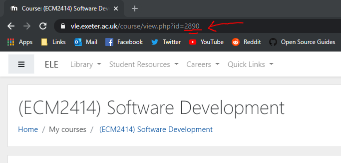

# ele-scraper

A web scraper for modules on Exeter Uni's VLE.



This program will download lecture slides, and similar resources, in various formats.

This program does **not** get lecture recaps or any other videos.

*By downloading, installing and/or using ele-scraper ("Software"), you agree that the End User User License Agreement (EULA) is a legally binding and valid contract and agree to be bound by it.*


## Disclaimers

### Copyright

Any files on ELE are obviously under the copyright of Exeter University.

This tool helps to access the material that students already have permission to access.

Please consider:

- You should not use this software to aid the **distribution** of material.

- You should not use this software to access **unauthorised material**.

*This software uses the student's login, and so may only access anything accessible by the student already.*

### Damages

Out of the box, this software is limited to downloading **1 file** per module.

The user must manually edit the source code in order to increase this limit.

I cannot be held liable for any damage that arises through the improper use of the software.

**Denial of service is a real risk when it comes to automated web scraping.**

### Manifesto

With coronavirus rendering almost all exams to be open-book and online, there's a real fear that ELE will receive a high-volume of requests, especially where multiple exams will start on the same hour of the same day.

By using this scraper to download module content:

- Students can use offline notes and not worry about slowness or downtime on ELE.

- ELE will not be dogpilled during exams, as students will have downloaded contents prior to the exam.

Since this software serves to benefit both students and the university, I feel it should be made available.


## Getting Started

### Prerequisites

Python 3 (with pip):
```
https://www.python.org/downloads/
```

### Installing

Navigate to the repository and create a virtual environment:

```
$ python -m venv ".env"
```

Activate the virtual environment:

```
$ source .env/bin/activate      # Linux
$ source .env/Scripts/activate  # Windows
```

Install the required packages:

```
$ pip install -r requirements.txt
```

Run the script (with `-u` for real-time console logs):

```
$ cd src/

$ python -u main.py
```

You'll be asked for your username, password, and a course ID.

The course ID can be grabbed from the URL of the course's page.



Your username and password aren't sent anywhere except for the log-in form.

Downloaded files are placed in `C:\Users\<username>\downloads\ele-scraper`.

## Extras

### Built With

* [Selenium]([https://pypi.org/project/selenium/) - Automate web browser interaction.

### Authors

* **Lewis Lloyd** (GitHub: [LloydTao](https://github.com/LloydTao), Twitter: [LloydTao](https://twitter.com/LloydTao))

See also the list of [contributors](https://github.com/Code-Scamps/website/contributors) who participated in this project.

---

This project is licensed under the MIT License - see the [LICENSE.md](LICENSE.md) file for details.
